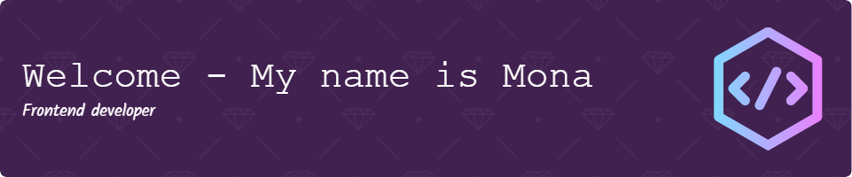

<!--
**Littlaa/Littlaa** is a ✨ _special_ ✨ repository because its `README.md` (this file) appears on your GitHub profile.

Here are some ideas to get you started:

- 🔭 I’m currently working on ...
- 🌱 I’m currently learning ...
- 👯 I’m looking to collaborate on ...
- 🤔 I’m looking for help with ...
- 💬 Ask me about ...
- 📫 How to reach me: ...
- 😄 Pronouns: ...
- ⚡ Fun fact: ...
-->

# :book: About me

- From the 1990s :floppy_disk:
- Studying to be a Frontend Developer :computer: :mortar_board:
- Gamer :video_game:
- I'm a night 🦉

## Languages

## :wrench: Working on

- Getting better at API fetches
- Finishing up projects
- Start a new project to keep coding up-to-date
- Learn React

## :memo: Bucket list

## :mailbox: Contact

[My LinkedIn page](http://www.linkedin.com/in/mona-dagsland-56ba85226)

## Sources used to make this profile README

[Header](https://leviarista.github.io/github-profile-header-generator/)

[Emoji:star:](https://www.webfx.com/tools/emoji-cheat-sheet/)
